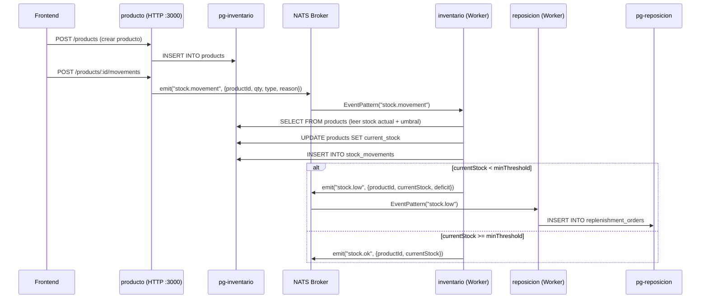

# Grupo 10 — Inventario de Almacén: Plan de Implementación de Microservicios (v4)

## Contexto del Proyecto

**Caso de uso:** Un almacén de distribución necesita controlar su stock y reponer automáticamente los productos que se agotan. Cada entrada o salida de mercadería actualiza el nivel de stock; cuando un producto cae por debajo de su umbral mínimo, se genera una orden de reposición al proveedor.

**Proyecto de referencia:** `nest` (orders + notifications con NATS + Redis)  
**Proyecto destino:** `inventario-system`  
**Base de datos:** PostgreSQL — **2 instancias** (pg-inventario compartida + pg-reposicion independiente)

---

## Estado Actual del Proyecto

- ✅ 3 apps creadas: `producto`, `inventario`, `reposicion`
- ✅ `apps/inventario-system` eliminada
- ✅ `nest-cli.json` con root apuntando a `apps/producto`
- ❌ Falta librería `contracts` → `nest g lib contracts`
- ❌ Falta `docker-compose.yml`
- ❌ Faltan dependencias: `@nestjs/microservices`, `nats`, `@nestjs/typeorm`, `typeorm`, `pg`
- ❌ `tsconfig.json` necesita cambiar a `commonjs`
- ❌ `nest-cli.json` aún contiene entrada `inventario-system` en projects

---

## Arquitectura Propuesta

### Microservicios

| Microservicio | Tipo | Rol | Puerto/Transporte |
|---|---|---|---|
| **producto** | HTTP (detrás del ALB) | CRUD de productos. Publica `stock.movement` | HTTP `:3000` + cliente NATS |
| **inventario** | Worker NATS | Registra movimientos, evalúa umbral, emite `stock.low`/`stock.ok` | Solo NATS |
| **reposicion** | Worker NATS | Genera órdenes de reposición automáticas | Solo NATS |

### Bases de Datos — 2 Instancias PostgreSQL

```
┌──────────────────────────────────┐    ┌──────────────────────┐
│    pg-inventario (puerto 5432)   │    │  pg-reposicion       │
│    Compartida: producto +        │    │  (puerto 5433)       │
│                inventario        │    │                      │
│                                  │    │  ┌────────────────┐  │
│  ┌───────────┐  ┌──────────────┐ │    │  │ replenishment  │  │
│  │ products  │  │    stock_    │ │    │  │   _orders      │  │
│  │           │  │  movements  │ │    │  └────────────────┘  │
│  └───────────┘  └──────────────┘ │    │                      │
│   (producto      (inventario     │    │   (reposicion         │
│    escribe)       escribe+lee)   │    │    escribe)           │
└──────────────────────────────────┘    └──────────────────────┘
```

- **`producto`** escribe en `products` (CRUD)
- **`inventario`** lee de `products` + escribe en `stock_movements` — acceso directo, sin copias
- **`reposicion`** escribe en `replenishment_orders` — completamente independiente

### Flujo de Eventos NATS



> [!IMPORTANT]
> **Flujo clave:** `producto` NO actualiza el stock. Solo crea el producto y publica el evento de movimiento. Es `inventario` quien actualiza el `currentStock` en la tabla `products` después de procesar el movimiento. Esto garantiza que la lógica de stock esté centralizada en un solo servicio.

### Modelo de Datos (Entidades TypeORM)

**Tabla `products`** — en `pg-inventario`:
```typescript
@Entity('products')
export class Product {
  @PrimaryGeneratedColumn('uuid')
  id: string;

  @Column({ unique: true })
  sku: string;

  @Column()
  name: string;

  @Column({ type: 'int', default: 0 })
  currentStock: number;

  @Column({ type: 'int' })
  minThreshold: number;

  @CreateDateColumn()
  createdAt: Date;

  @UpdateDateColumn()
  updatedAt: Date;
}
```

**Tabla `stock_movements`** — en `pg-inventario`:
```typescript
@Entity('stock_movements')
export class StockMovement {
  @PrimaryGeneratedColumn('uuid')
  id: string;

  @Column()
  productId: string;

  @Column()
  sku: string;

  @Column({ type: 'int' })
  quantity: number;

  @Column({ type: 'varchar' })
  type: 'IN' | 'OUT';

  @Column()
  reason: string;

  @Column({ type: 'int' })
  previousStock: number;

  @Column({ type: 'int' })
  newStock: number;

  @CreateDateColumn()
  timestamp: Date;
}
```

**Tabla `replenishment_orders`** — en `pg-reposicion`:
```typescript
@Entity('replenishment_orders')
export class ReplenishmentOrder {
  @PrimaryGeneratedColumn('uuid')
  id: string;

  @Column()
  productId: string;

  @Column()
  sku: string;

  @Column()
  productName: string;

  @Column({ type: 'int' })
  quantityToOrder: number;

  @Column({ type: 'varchar', default: 'PENDING' })
  status: 'PENDING' | 'APPROVED';

  @Column({ type: 'int' })
  currentStock: number;

  @Column({ type: 'int' })
  minThreshold: number;

  @CreateDateColumn()
  createdAt: Date;
}
```

### Contratos de Eventos NATS

```typescript
// stock.movement — Publicado por producto, consumido por inventario
interface StockMovementEvent {
  productId: string;
  quantity: number;
  type: 'IN' | 'OUT';
  reason: string;
  timestamp: string;
}

// stock.low — Publicado por inventario, consumido por reposicion
interface StockLowEvent {
  productId: string;
  sku: string;
  productName: string;
  currentStock: number;
  minThreshold: number;
  deficit: number;         // threshold - currentStock
  detectedAt: string;
}

// stock.ok — Publicado por inventario (informativo)
interface StockOkEvent {
  productId: string;
  sku: string;
  currentStock: number;
  checkedAt: string;
}
```

> [!NOTE]
> El evento `stock.movement` es liviano (solo `productId` + cantidad). `inventario` lee el resto de la info (sku, name, threshold) directamente de la BD compartida. En cambio, `stock.low` es rico en datos porque `reposicion` está en una BD separada y necesita toda la info.

---

## Proposed Changes

---

### Componente 1: Configuración Base del Monorepo

#### [MODIFY] [package.json](file:///f:/JHOEL/SEMESTRE%202-2025/DIPLOMADO/PROYECTO_FINAL_V1/inventario-system/package.json)
- Agregar dependencias: `@nestjs/microservices`, `nats`, `@nestjs/typeorm`, `typeorm`, `pg`
- Agregar scripts:
  - `"start:producto": "nest start producto --watch"`
  - `"start:inventario": "nest start inventario --watch"`
  - `"start:reposicion": "nest start reposicion --watch"`
  - `"build:producto": "nest build producto"`
  - `"build:inventario": "nest build inventario"`
  - `"build:reposicion": "nest build reposicion"`
  - `"infra:up": "docker compose up -d"`
  - `"infra:down": "docker compose down"`
- Actualizar `description`
- Limpiar scripts obsoletos

#### [MODIFY] [tsconfig.json](file:///f:/JHOEL/SEMESTRE%202-2025/DIPLOMADO/PROYECTO_FINAL_V1/inventario-system/tsconfig.json)
- `module`: `nodenext` → `commonjs`
- `moduleResolution`: `nodenext` → `node`
- Eliminar `resolvePackageJsonExports`, `isolatedModules`
- Agregar paths: `"@app/contracts": ["libs/contracts/src"]`, `"@app/contracts/*": ["libs/contracts/src/*"]`

#### [MODIFY] [nest-cli.json](file:///f:/JHOEL/SEMESTRE%202-2025/DIPLOMADO/PROYECTO_FINAL_V1/inventario-system/nest-cli.json)
- Eliminar entrada `inventario-system` de `projects`
- Agregar entrada `contracts` (type: library) — después de ejecutar `nest g lib`

#### [NEW] [docker-compose.yml](file:///f:/JHOEL/SEMESTRE%202-2025/DIPLOMADO/PROYECTO_FINAL_V1/inventario-system/docker-compose.yml)
```yaml
services:
  nats:
    image: nats:2.10-alpine
    container_name: nats-broker
    restart: unless-stopped
    ports:
      - "4222:4222"
      - "8222:8222"
    command: ["-js", "-m", "8222"]
    healthcheck:
      test: ["CMD", "wget", "-q", "-O-", "http://localhost:8222/healthz"]
      interval: 5s
      timeout: 3s
      retries: 5

  pg-inventario:
    image: postgres:16-alpine
    container_name: pg-inventario
    restart: unless-stopped
    ports:
      - "5432:5432"
    environment:
      POSTGRES_DB: db_inventario
      POSTGRES_USER: admin
      POSTGRES_PASSWORD: admin123
    volumes:
      - pg_inventario_data:/var/lib/postgresql/data
    healthcheck:
      test: ["CMD-SHELL", "pg_isready -U admin -d db_inventario"]
      interval: 5s
      timeout: 3s
      retries: 5

  pg-reposicion:
    image: postgres:16-alpine
    container_name: pg-reposicion
    restart: unless-stopped
    ports:
      - "5433:5432"
    environment:
      POSTGRES_DB: db_reposicion
      POSTGRES_USER: admin
      POSTGRES_PASSWORD: admin123
    volumes:
      - pg_reposicion_data:/var/lib/postgresql/data
    healthcheck:
      test: ["CMD-SHELL", "pg_isready -U admin -d db_reposicion"]
      interval: 5s
      timeout: 3s
      retries: 5

volumes:
  pg_inventario_data:
  pg_reposicion_data:
```

---

### Componente 2: Librería Compartida `contracts`

Crear con `nest g lib contracts`, luego reemplazar contenido generado.

#### [NEW] `libs/contracts/src/nats.constants.ts`
- `NATS_SERVICE = 'NATS_SERVICE'`
- `DEFAULT_NATS_URL = 'nats://localhost:4222'`

#### [NEW] `libs/contracts/src/database.constants.ts`
- Constantes de conexión para `pg-inventario` y `pg-reposicion`

#### [NEW] `libs/contracts/src/products.contracts.ts`
- `STOCK_MOVEMENT_EVENT = 'stock.movement'`
- Interface: `StockMovementEvent`

#### [NEW] `libs/contracts/src/stock.contracts.ts`
- `STOCK_LOW_EVENT = 'stock.low'`, `STOCK_OK_EVENT = 'stock.ok'`
- Interfaces: `StockLowEvent`, `StockOkEvent`
- `STOCK_STATUS_PATTERN = 'stock.status'`

#### [NEW] `libs/contracts/src/replenishment.contracts.ts`
- `REPLENISHMENT_LIST_PATTERN = 'replenishment.list'`
- Interface: `ReplenishmentOrderDto`

#### [NEW] `libs/contracts/src/index.ts`
- Re-exports de todos los contratos

---

### Componente 3: Microservicio `producto` (HTTP + NATS Client)

CRUD de productos. Publica eventos de movimiento de stock.

#### [MODIFY] `apps/producto/src/main.ts`
- HTTP en puerto 3000, CORS habilitado, Logger

#### [MODIFY] `apps/producto/src/producto.module.ts`
- `TypeOrmModule.forRoot()` → `pg-inventario` (puerto 5432, db `db_inventario`)
- `TypeOrmModule.forFeature([Product])`
- `ClientsModule.register()` con NATS

#### [NEW] `apps/producto/src/entities/product.entity.ts`
#### [NEW] `apps/producto/src/dto/create-product.dto.ts`
#### [NEW] `apps/producto/src/dto/create-movement.dto.ts`

#### [MODIFY] `apps/producto/src/producto.controller.ts`

| Método | Ruta | Descripción |
|---|---|---|
| `POST` | `/products` | Crear producto |
| `GET` | `/products` | Listar todos |
| `GET` | `/products/:id` | Obtener por ID |
| `PUT` | `/products/:id` | Actualizar |
| `DELETE` | `/products/:id` | Eliminar |
| `POST` | `/products/:id/movements` | Registrar movimiento → emite `stock.movement` |
| `GET` | `/replenishment-orders` | Consultar órdenes (vía NATS → reposicion) |

#### [MODIFY] `apps/producto/src/producto.service.ts`
- CRUD con `Repository<Product>`
- `registerMovement()`: NO modifica stock, solo emite `stock.movement` vía NATS
- `getReplenishmentOrders()`: `nats.send('replenishment.list', ...)`

#### [NEW] `apps/producto/Dockerfile`

---

### Componente 4: Microservicio `inventario` (Worker NATS)

Procesa movimientos, actualiza stock, evalúa umbrales.

#### [MODIFY] `apps/inventario/src/main.ts`
- `NestFactory.createMicroservice()` con NATS (sin HTTP)

#### [MODIFY] `apps/inventario/src/inventario.module.ts`
- `TypeOrmModule.forRoot()` → `pg-inventario` (puerto 5432, db `db_inventario`)
- `TypeOrmModule.forFeature([Product, StockMovement])`
- `ClientsModule.register()` para publicar `stock.low`/`stock.ok`

#### [NEW] `apps/inventario/src/entities/stock-movement.entity.ts`

#### [MODIFY] `apps/inventario/src/inventario.controller.ts`
- `@EventPattern('stock.movement')` → procesar movimiento
- `@MessagePattern('stock.status')` → consultar estado de stock

#### [MODIFY] `apps/inventario/src/inventario.service.ts`
- `handleStockMovement(event)`:
  1. `SELECT * FROM products WHERE id = event.productId`
  2. Calcular `newStock` = currentStock ± quantity
  3. `UPDATE products SET current_stock = newStock`
  4. `INSERT INTO stock_movements` (con previousStock y newStock)
  5. Si `newStock < minThreshold` → `emit('stock.low', {...})`
  6. Si no → `emit('stock.ok', {...})`

> **Validación clave:** Solo emitir `stock.low` cuando el stock realmente cae por debajo del umbral.

#### [NEW] `apps/inventario/Dockerfile`

---

### Componente 5: Microservicio `reposicion` (Worker NATS)

Genera órdenes de reposición automáticas.

#### [MODIFY] `apps/reposicion/src/main.ts`
- `NestFactory.createMicroservice()` con NATS

#### [MODIFY] `apps/reposicion/src/reposicion.module.ts`
- `TypeOrmModule.forRoot()` → `pg-reposicion` (puerto 5433, db `db_reposicion`)
- `TypeOrmModule.forFeature([ReplenishmentOrder])`

#### [NEW] `apps/reposicion/src/entities/replenishment-order.entity.ts`

#### [MODIFY] `apps/reposicion/src/reposicion.controller.ts`
- `@EventPattern('stock.low')` → generar orden
- `@MessagePattern('replenishment.list')` → listar órdenes

#### [MODIFY] `apps/reposicion/src/reposicion.service.ts`
- `handleStockLow(event)`:
  1. Verificar si ya existe orden PENDING para ese producto
  2. Calcular cantidad: `deficit * 2`
  3. Crear `ReplenishmentOrder` con status PENDING
  4. Persistir en `pg-reposicion`
- `listOrders()`: Devolver todas las órdenes

#### [NEW] `apps/reposicion/Dockerfile`

---

## Resumen de Estructura Final

```
inventario-system/
├── apps/
│   ├── producto/               ← HTTP (CRUD) → pg-inventario
│   │   ├── Dockerfile
│   │   ├── tsconfig.app.json
│   │   └── src/
│   │       ├── main.ts
│   │       ├── producto.module.ts
│   │       ├── producto.controller.ts
│   │       ├── producto.service.ts
│   │       ├── dto/
│   │       │   ├── create-product.dto.ts
│   │       │   └── create-movement.dto.ts
│   │       └── entities/
│   │           └── product.entity.ts
│   ├── inventario/             ← Worker NATS → pg-inventario (compartida)
│   │   ├── Dockerfile
│   │   ├── tsconfig.app.json
│   │   └── src/
│   │       ├── main.ts
│   │       ├── inventario.module.ts
│   │       ├── inventario.controller.ts
│   │       ├── inventario.service.ts
│   │       └── entities/
│   │           └── stock-movement.entity.ts
│   └── reposicion/             ← Worker NATS → pg-reposicion (independiente)
│       ├── Dockerfile
│       ├── tsconfig.app.json
│       └── src/
│           ├── main.ts
│           ├── reposicion.module.ts
│           ├── reposicion.controller.ts
│           ├── reposicion.service.ts
│           └── entities/
│               └── replenishment-order.entity.ts
├── libs/
│   └── contracts/              ← Contratos compartidos
│       ├── tsconfig.lib.json
│       └── src/
│           ├── index.ts
│           ├── nats.constants.ts
│           ├── database.constants.ts
│           ├── products.contracts.ts
│           ├── stock.contracts.ts
│           └── replenishment.contracts.ts
├── docker-compose.yml          ← NATS + pg-inventario + pg-reposicion
├── nest-cli.json
├── package.json
├── tsconfig.json
└── tsconfig.build.json
```

---

## Orden de Ejecución

1. Crear librería contracts → `nest g lib contracts`
2. Configurar monorepo → package.json, tsconfig.json, nest-cli.json
3. Crear docker-compose.yml
4. Instalar dependencias → `npm install`
5. Implementar contracts
6. Implementar producto (HTTP + CRUD + emitir eventos)
7. Implementar inventario (Worker + movimientos + evaluar umbrales)
8. Implementar reposicion (Worker + órdenes automáticas)
9. Levantar y probar E2E

---

## Verification Plan

### Levantar Infraestructura
```bash
npm run infra:up
docker compose ps   # Verificar: nats-broker, pg-inventario, pg-reposicion
```

### Compilar y Ejecutar
```bash
npm run start:producto      # Terminal 1
npm run start:inventario    # Terminal 2
npm run start:reposicion    # Terminal 3
```

### Flujo Completo E2E
```bash
# 1. Crear producto con stock=50, umbral=10
curl -X POST http://localhost:3000/products \
  -H "Content-Type: application/json" \
  -d '{"sku":"PROD-001","name":"Widget A","currentStock":50,"minThreshold":10}'

# 2. Salida de 45 unidades → stock queda en 5 (bajo umbral 10)
curl -X POST http://localhost:3000/products/{id}/movements \
  -H "Content-Type: application/json" \
  -d '{"quantity":45,"type":"OUT","reason":"venta"}'

# 3. Verificar orden de reposición generada automáticamente
curl http://localhost:3000/replenishment-orders

# 4. Verificar stock actualizado a 5
curl http://localhost:3000/products/{id}
```

**Resultado esperado:** El flujo `stock.movement → inventario → stock.low → reposicion` genera automáticamente una orden de reposición por 10 unidades (deficit 5 × 2).
